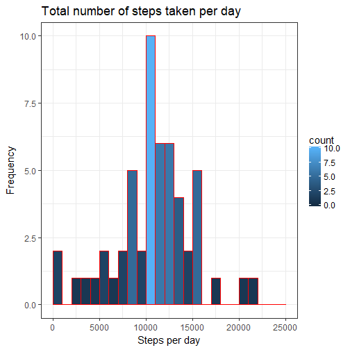
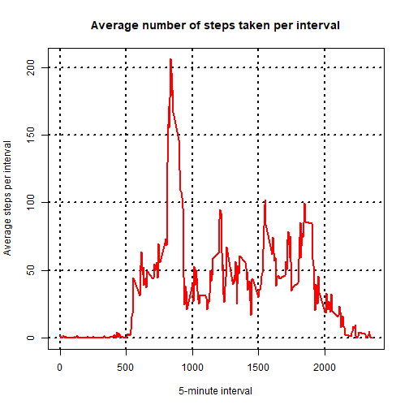
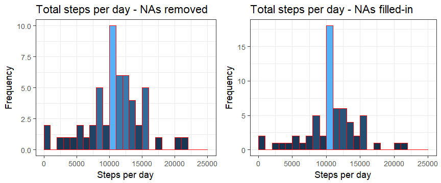

## Introduction

It is now possible to collect a large amount of data about personal movement using activity monitoring devices such as a Fitbit, Nike Fuelband, or Jawbone Up. These type of devices are part of the "quantified self" movement - a group of enthusiasts who take measurements about themselves regularly to improve their health, to find patterns in their behavior, or because they are tech geeks. But these data remain under-utilized both because the raw data are hard to obtain and there is a lack of statistical methods and software for processing and interpreting the data.

This assignment makes use of data from a personal activity monitoring device. This device collects data at 5 minute intervals through out the day. The data consists of two months of data from an anonymous individual collected during the months of October and November, 2012 and include the number of steps taken in 5 minute intervals each day.

The dataset contains 3 variables and 17568 observations over a period of 61 days, October and November 2012.

Variables:

* steps: Number of steps taking in a 5-minute interval (missing values are coded as NA)

* date: The date on which the measurement was taken in YYYY-MM-DD format, there are 61 days in the dataset.

* interval: Identifier for the 5-minute interval in which measurement was taken, There are 288 intervals per day (24 hours * 12 intervals of 5 minutes per hour), numbered from 0 to 2355. Interval 115 will be the 5 minutes interval starting at 01:15am. For each day, the first interval is 0 (00:00pm), the last interval is 2355 (11:55pm)

The chunks below follows the proposed workflow from the Coursera [assignment page](https://www.coursera.org/learn/reproducible-research/peer/gYyPt/course-project-1).

## Load and preprocess the data

First download the data from the forked Github repository (ONLY NEED TO DO THIS ONCE). The data was downloaded on August 12th, 2018.


```r
rm(list=ls())
if(!dir.exists("C:/Users/ericr/Downloads/Coursera Data/Reproducible Research"))
    {dir.create("C:/Users/ericr/Downloads/Coursera Data/Reproducible Research")}
fileUrl <- "https://github.com/EricRops/RepData_PeerAssessment1/raw/master/activity.zip"
download.file(fileUrl, "C:/Users/ericr/Downloads/Coursera Data/Reproducible Research/activity.zip", 
    mode = "wb")
unzip(zipfile = "C:/Users/ericr/Downloads/Coursera Data/Reproducible Research/activity.zip", 
    exdir = "C:/Users/ericr/Downloads/Coursera Data/Reproducible Research")
```

Set working directory, load the data and examine the dataframe


```r
setwd("C:/Users/ericr/Google Drive/Coursera/Reproducible Research")
activity <- read.csv(file = "C:/Users/ericr/Downloads/Coursera Data/Reproducible Research/activity.csv", 
    stringsAsFactors = FALSE)
summary(activity)
```

```
##      steps          date              interval   
##  Min.   :  0    Length:17568       Min.   :   0  
##  1st Qu.:  0    Class :character   1st Qu.: 589  
##  Median :  0    Mode  :character   Median :1178  
##  Mean   : 37                       Mean   :1178  
##  3rd Qu.: 12                       3rd Qu.:1766  
##  Max.   :806                       Max.   :2355  
##  NA's   :2304
```

```r
str(activity)
```

```
## 'data.frame':	17568 obs. of  3 variables:
##  $ steps   : int  NA NA NA NA NA NA NA NA NA NA ...
##  $ date    : chr  "2012-10-01" "2012-10-01" "2012-10-01" "2012-10-01" ...
##  $ interval: int  0 5 10 15 20 25 30 35 40 45 ...
```

We can see that there are 2304 missing steps values. Also, the dates variable is not properly set as a Date class. So let's address both these issues here:


```r
activity$date <- as.Date(activity$date)
activity.rm <- activity[which(!is.na(activity$steps)), ]
```

## What is the mean total number of steps per day?

The number of steps taken is measured in 5-minute intervals, so in order to compute the total number of steps taken for each day we will aggregate the data using the aggregate function, taking the sum of the total steps for each date. 

```r
steps.perday <- aggregate(steps ~ date, data = activity, FUN = sum, na.rm = TRUE)
#steps.perday <- tapply(X = activity.rm$steps, INDEX = activity.rm$date, FUN = sum)
```

Now let's make a histogram of the total number of steps per day using ggplot2

```r
library(ggplot2)
ggplot(data = steps.perday, mapping = aes(x = steps, fill=..count..)) + 
    geom_histogram(binwidth = 1000, breaks = seq(0, 25000, by = 1000), col = "red") +
    labs(title = "Total number of steps taken per day", x = "Steps per day", y = "Frequency") + 
    theme_bw(base_size = 15)
```



Now compute the mean and median number of steps taken per day

```r
mean.steps <- mean(steps.perday$steps)
median.steps <- median(steps.perday$steps)
# Set a standard decimal format to display the results
mean.steps <- format(mean.steps,digits=2)
median.steps <- format(median.steps,digits=2)
```
Mean steps per day is __10766__.  
Median steps per day is __10765__.

## What is the average daily activity pattern?

### 1. Time series plot
Time series plot of the 5-minute interval (x-axis) and the average number of steps taken, averaged across all days (y-axis)

We will use the aggregate function to get the mean over all days, for each time interval (288 intervals per day, numbered from 0 to 2355), then create the time-series plot


```r
steps.interval.mean <- aggregate(steps ~ interval, data = activity, FUN = mean, na.rm = TRUE)
plot(steps.interval.mean$interval, steps.interval.mean$steps, type = "l", col = "red", 
     xlab = "5-minute interval", ylab = "Average steps per interval", 
     main = "Average number of steps taken per interval", lwd = 2, 
     panel.first = grid(lwd = 2, col="black"))
```



### 2. Which 5-minute interval, on average across all the days in the dataset, contains the maximum number of steps? 


```r
options(digits=2) # keep 5 significant digits for printing
max.steps <- max(steps.interval.mean$steps)
max.interval <- steps.interval.mean$interval[which(steps.interval.mean$steps == max.steps)]
```
The interval with the highest average number of steps is __835__ with __206.17__ steps

## Imputing missing values
### 1. Calculate total number of missing values in the dataset

```r
sum(is.na(activity))
```

```
## [1] 2304
```
There are __2304__ missing values from the dataset. As seen from the summary results at the top of this document, all the missing values are from the "steps" variable

### 2. Devise a strategy for filling in all of the missing values in the dataset

Let's create 2 "quick-look" plots to help decide the strategy: plotting the spread of NAs per interval, and the spead of NAs per day

```r
missing.values <- subset(x = activity, subset = is.na(steps))
par(mfrow = c(2, 1), mar = c(2, 2, 1, 1))
hist(missing.values$interval, main = "NA spread per interval", xlim = c(0, 2500))

# For the second histogram, calculated values for total number of days, and the R numeric value for the 1st day, to help with formatting the x-axis
Number.Of.Days <- length(unique(activity$date))
Day1.Numeric <- min(as.numeric(unique(activity$date)))
hist(as.numeric(missing.values$date-(Day1.Numeric)), main = "NA spread per day", breaks = Number.Of.Days)
```


We can see that the NAs are spread fairly evenly throughout all intervals, but are only spread through 8 entire days. 

Therefore, to minimize bias, we will fill in the NAs using the mean for that 5-minute interval.

### 3. Create a new dataset with the missing data filled in

```r
# Calculate mean of steps for each 288 intervals
steps.mean.interval <- tapply(X = activity$steps, INDEX = activity$interval, FUN = mean, na.rm = TRUE)

# Split the data into NA and non-NA parts
activity.NAs <- activity[is.na(activity$steps), ]
activity.non.NAs <- activity[!is.na(activity$steps), ]

# Replace missing values 
activity.NAs$steps <- as.factor(activity.NAs$interval)
levels(activity.NAs$steps) <- steps.mean.interval

# Change the steps variable back to an integer
levels(activity.NAs$steps) <- round(as.numeric(levels(activity.NAs$steps)))
activity.NAs$steps <- as.integer(as.vector(activity.NAs$steps))

# Merge the filled NA and non-NA datasets back together
activity.filled <- rbind(activity.NAs, activity.non.NAs)
```

### 4. Make a histogram of the total number of steps taken per day (with NAs removed and NAs filled in)

```r
# First, we use the aggregate function to compute the total steps for each day in the imputed dataset
steps.perday.filled <- aggregate(steps ~ date, data = activity.filled, FUN = sum, na.rm = TRUE)

# Now, we make 2 histograms comparing total steps per day for the NA dataset computed earlier 
# (steps.perday) and the imputed dataset (steps.perday.filled)
library(gridExtra) # package to allow plotting of multiple ggplot panels side by side

plot1 <- ggplot(data = steps.perday, mapping = aes(x = steps, fill=..count..)) + 
    geom_histogram(binwidth = 1000, breaks = seq(0, 25000, by = 1000), col = "red") +
    labs(title = "Total steps per day - NAs removed", x = "Steps per day", y = "Frequency") + 
    theme_bw(base_size = 18) + theme(legend.position="none")
plot2 <- ggplot(data = steps.perday.filled, mapping = aes(x = steps, fill=..count..)) + 
    geom_histogram(binwidth = 1000, breaks = seq(0, 25000, by = 1000), col = "red") +
    labs(title = "Total steps per day - NAs filled-in", x = "Steps per day", y = "Frequency") +
    theme_bw(base_size = 18) + theme(legend.position="none") 

grid.arrange(plot1, plot2, nrow=1)
```



### Calculate the mean and median steps taken, and store the new and old results in the same dataframe for easier comparison


```r
mean.steps.filled <- mean(steps.perday.filled$steps)
median.steps.filled <- median(steps.perday.filled$steps)
# Set a standard decimal format to display the results
mean.steps.filled <- format(mean.steps.filled,digits=2)
median.steps.filled <- format(median.steps.filled,digits=2)

# Store results in a simple dataframe
results <- data.frame(c(mean.steps, median.steps), c(mean.steps.filled, median.steps.filled))
colnames(results) <- c("NAs Removed", "NAs Imputed")
rownames(results) <- c("Mean", "Median")
```

Output a clean table using the knitr kable function

```r
library(knitr)
kable(results, caption = "Average steps per day comparison using original data and imputed data")
```


|       |NAs Removed |NAs Imputed |
|:------|:-----------|:-----------|
|Mean   |10766       |10766       |
|Median |10765       |10762       |

__Findings:__ Imputing the missing values had essentially zero effect on the mean and median values of steps per day.  
For the total daily number of steps, both histograms show the same trends. However the imputed NAs show higher counts from 10,000 to 15,000, and a slightly more detailed spread.

## Are there differences in activity patterns between weekdays and weekends?
### 1. Create a new factor variable (dayType) in the filled dataset (activity.filled) with two levels - "weekday" and "weekend"


```r
# Use ifelse to categorize Saturday and Sunday as factor level "weekend", and the rest as "weekday"
activity.filled$dayType <- ifelse(weekdays(activity.filled$date) == "Saturday" | 
    weekdays(activity.filled$date) == "Sunday", "weekend", "weekday")
activity.filled$dayType <- as.factor(activity.filled$dayType)
head(activity.filled)
```

```
##   steps       date interval dayType
## 1     2 2012-10-01        0 weekday
## 2     0 2012-10-01        5 weekday
## 3     0 2012-10-01       10 weekday
## 4     0 2012-10-01       15 weekday
## 5     0 2012-10-01       20 weekday
## 6     2 2012-10-01       25 weekday
```

### 2. Two panel time series plot
We will use the aggregate function to get the mean steps for each time interval + dayType pair.


```r
# This use of "aggregate" computes the mean steps for each (interval + weekday) and each (interval +
# weekend). If there were more variables to sort, it would likely be easier to use dplyr arguments to 
# modify the dataframe
steps.interval.mean.dayType <- aggregate(steps ~ interval + dayType, data = activity.filled, 
    FUN = mean, na.rm = TRUE)
head(steps.interval.mean.dayType)
```

```
##   interval dayType steps
## 1        0 weekday 2.289
## 2        5 weekday 0.400
## 3       10 weekday 0.156
## 4       15 weekday 0.178
## 5       20 weekday 0.089
## 6       25 weekday 1.578
```
Now create the two panels time series plot

```r
library(ggplot2)
ggplot(data = steps.interval.mean.dayType, mapping = aes(x = interval, y = steps, color = dayType)) + 
    geom_line(size = 1) + facet_wrap(~dayType, ncol = 1, nrow = 2) +
    labs(title = "Steps per day: Weekdays vs Weekends", 
    x = "5-minute time interval (ie. 1500 = 3:00pm)", y = "Average Steps") + theme_bw(base_size = 15) + 
    theme(legend.position="none", panel.grid.major = element_line(colour = "black", linetype = "dashed"), 
    panel.grid.minor = element_blank())
```


__Findings:__  
During the week, the test subject seems to start moving around 5:30am (gross), with peak activity around 7:30am (exercise?), and activity rapidly slows after 7:30pm.  
On weekends, the test subject seems to start moving around 7:30am. Activity is more spread from 8:00am to 8:30pm, with activity rapidly slowing after 9:00pm. 

# Use the following command in R to create the MD file (and properly store the figures in a figure directory)
library(knitr)
knit("PA1_template_FINAL.Rmd","PA1_template_FINAL.md")


